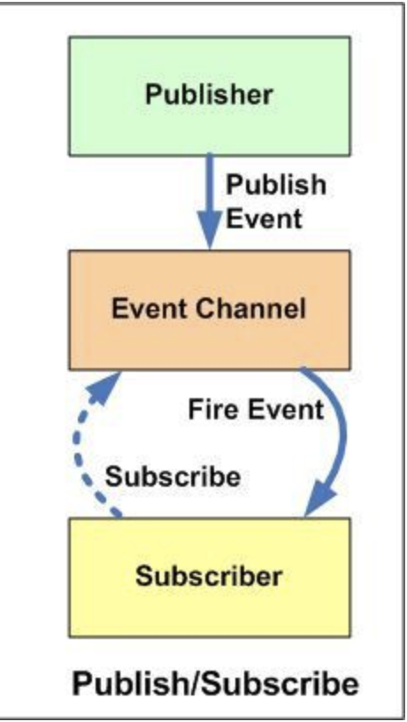

<div align="center">
<h1>Simulador de Antecipação de Recebíveis</h1>


<p>Simulador que calcula recebíveis baseado em taxa de MDR, valor de venda e quantidade de parcelas.</p>

[](https://travis-ci.org/npm/npm) [](https://www.npmjs.com/package/npm) [](http://makeapullrequest.com) [](https://github.com/patrick-narciso/anticipation-calculator/blob/master/LICENSE)

</div>

## Desenvolvimento

### Tecnologias Utilizadas

- HTML 5
- CSS in JS com [emotion](https://emotion.sh/docs/emotion)
- Javascript
- [Jest](https://jestjs.io/)
- [Webpack](https://webpack.js.org/)
- [ESlint](https://eslint.org/)
- [Prettier](https://prettier.io/)
- [Babel](https://babeljs.io/)

### Pré-requisitos

Para execução e desenvolvimento do projeto é necessário possuir instalado [Node](https://nodejs.org/en/)

### Setup Dev

Para ver o projeto rodando, primeiro clone o repositório.

```shell
git clone https://github.com/patrick-narciso/anticipation-calculator.git
```

Navegue até o diretório e instale as dependências do projeto e da biblioteca
responsável por efetuar os cálculos(posteriormente, ela pode ser separada em outro projeto).

```shell
cd anticipation-calculator/
npm install
cd ./packages/receivables-calculator
npm install && npm run build
```

Feito isso, as dependências estarão instaladas e a versão de distribuição da biblioteca
gerada já compilada para versões de browsers mais antigas. Agora, bastar executar o comando abaixo, abrirá uma aba no seu browser principal na porta 8080 com o projeto rodando.

```shell
cd anticipation-calculator/
npm start
```

### Release

Para gerar release basta executar

```shell
npm run release
```

Feito isso, abrirá uma CLI interativa com algumas perguntas, após respondê-las será
feito um commit de release, gerada uma tag no repositório e lançado um release com a tag.

## Versionamento

Para versionamento está sendo utilizada semantic version [SemVer](http://semver.org/).

## Testes

Para execução de testes automatizados, basta executar

```shell
npm run test
```

Caso esteja desenvolvendo mais testes, pode executar os testes com watch

```shell
npm run test:watch
```

## Design Pattern

Para este projeto foi utilizado ao máximo o paradigma de programação funcional. Prezando
por dados imutáveis, funções puras, coesas e curtas. Foi utilizado também o padrão PubSub (publisher-subscriber), basicamente ao usuário inputar os dados a biblioteca efetua o cálculo,
o objeto de dados retornado é publicado em um tópico, tópico esse que o componente da página principal da aplicação está inscrito, efetua a leitura da mensagem e atualiza o estado do componente e os valores dos recebíveis. Abaixo, segue uma imagem de como funciona o padrão PubSub.

<div align="center">
  
</div>

## Licensing

[MIT](LICENSE)
